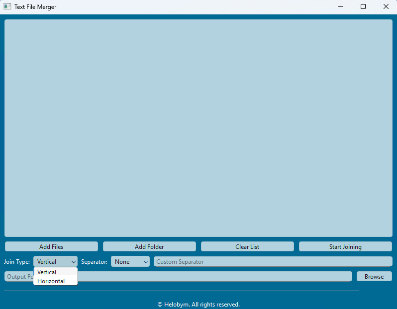
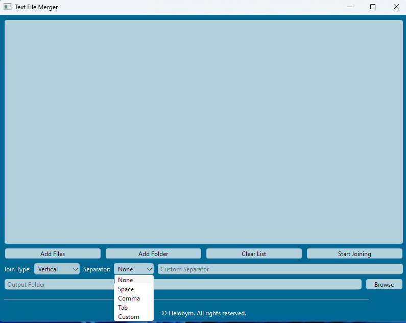

Text Pattern Extractor features batch processing, sophisticated regex matching, result filtering, and export to text/Excel formats. The user-friendly interface includes drag-and-drop support and file management tools. Ideal for developers, data analysts, and anyone needing to extract information from large text files using pattern matching.

[Demo Video](https://youtu.be/ycoTB67nFb0?si=XlmpQG_-9G2wqQvH)

